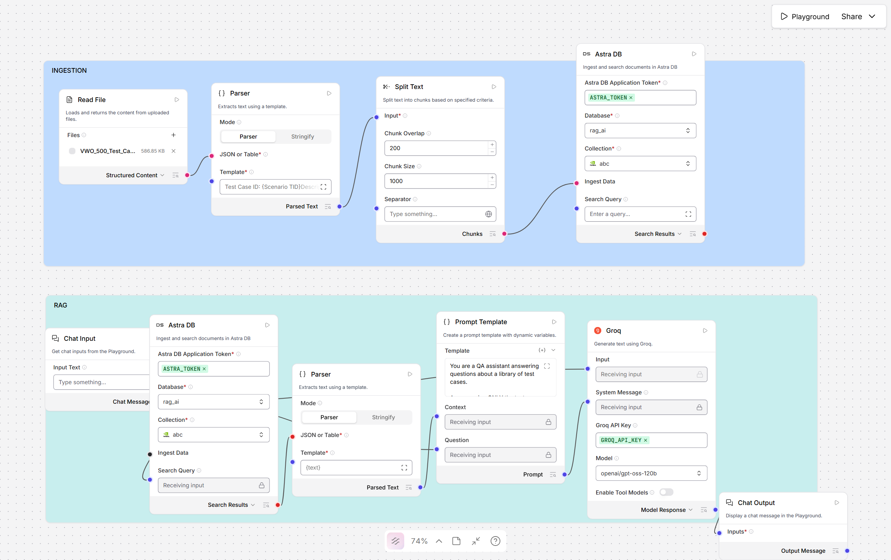
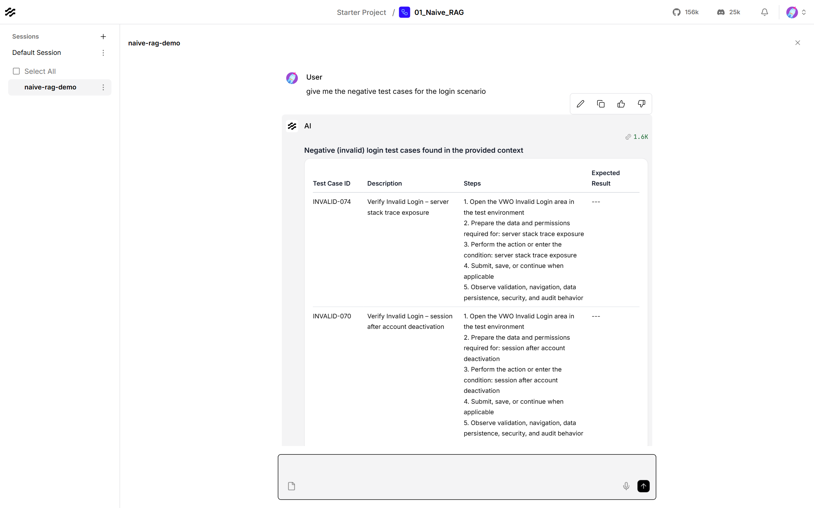
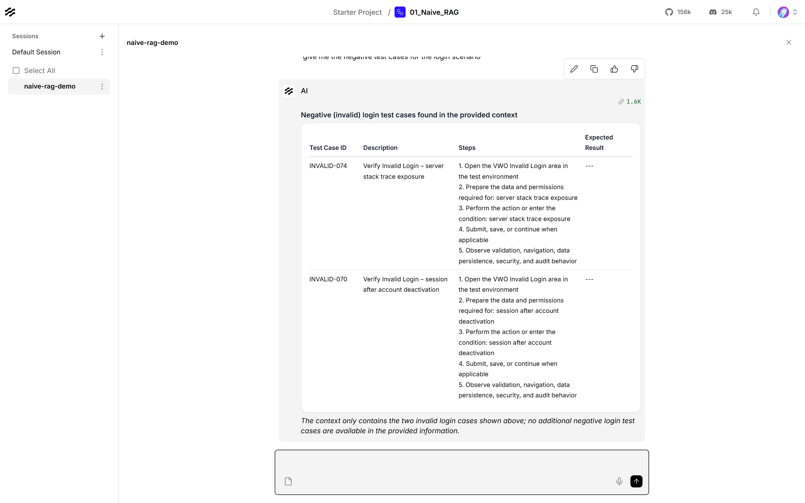

# Naive RAG in Langflow (Astra DB + Groq)

The same idea as the n8n workflows in [`../n8n workflows`](../n8n%20workflows/),
built in Langflow: load a CSV of 500 VWO login test cases into a vector
database, then ask questions about them in a chat.

## Contents

| File | What it is |
|---|---|
| [01_Naive_RAG_langflow.json](01_Naive_RAG_langflow.json) | The flow. Import it into Langflow |
| [data/VWO_500_Test_Cases.csv](data/VWO_500_Test_Cases.csv) | The knowledge base: 500 test cases across 7 areas (Login, Valid / Invalid login, Admin, Logged-in admin, Support, A/B tests) |
| [naive_rag_langflow_flow.png](naive_rag_langflow_flow.png) | The whole flow on the canvas |
| [naive_rag_result_question_and_answer.png](naive_rag_result_question_and_answer.png) | Playground: the question and the start of the answer |
| [naive_rag_result_answer_continued.png](naive_rag_result_answer_continued.png) | Playground: further down the same answer |
| [naive_rag_result_answer.md](naive_rag_result_answer.md) | The full answer as text |

## How it works

The flow has two independent parts.

**Ingestion** runs once, to fill the database:

| Node | What it does |
|---|---|
| Read File | Loads `VWO_500_Test_Cases.csv` |
| Parser | Turns each row into a text block: `Test Case ID`, Description, Precondition, Test Steps, Execution Steps, Expected / Actual Result, Status, Executed By, Priority, Automation Status, Comments |
| Split Text | Cuts the text into chunks of up to 1,000 characters with 200 overlap, splitting on newlines |
| Astra DB (ingest) | Stores the chunks in collection `abc` of database `rag_ai`. Astra embeds them on its side with NVIDIA's model, so no embedding API key is needed |

**RAG** runs on every chat message:

| Node | What it does |
|---|---|
| Chat Input | The question |
| Astra DB (search) | Finds the 4 chunks most similar to the question in the same collection |
| Type Convert | Turns the search results into text |
| Prompt Template | Puts the results and the question together |
| Groq | `openai/gpt-oss-120b` writes the answer |
| Chat Output | Shows it in the Playground |

## Requirements

| Thing | Notes |
|---|---|
| Langflow 1.12.4 | Built and tested on this version |
| Astra DB account | Free tier. A database and a collection that uses **NVIDIA** embeddings (Astra's built-in "vectorize" option) |
| Astra application token | Stored in Langflow as the global variable `ASTRA_TOKEN` |
| Groq API key | Free from [console.groq.com](https://console.groq.com). Stored in Langflow as `GROQ_API_KEY` |

## Setup

1. In Langflow, go to **Settings → Global Variables** and add `ASTRA_TOKEN` and
   `GROQ_API_KEY`, both of type **Credential**.
2. In Astra, create a database and a collection with **NVIDIA** as the
   embedding provider.
3. In Langflow, choose **New Flow → Import** and pick
   [01_Naive_RAG_langflow.json](01_Naive_RAG_langflow.json).
4. In **both** Astra DB nodes, select your own **Database** and
   **Collection**. The ones in the file belong to the original account. Both
   nodes must point at the same collection.
5. In **Read File**, upload [data/VWO_500_Test_Cases.csv](data/VWO_500_Test_Cases.csv).

## Usage

**1. Ingest (once).** Click the ▶ on the ingest **Astra DB** node in the
INGESTION group. This runs Read File → Parser → Split Text → Astra DB. Running it
again adds every chunk a second time, so clear the collection first if you
re-ingest.

**2. Ask.** Open **Playground** and ask a question, for example
`give me the negative test cases for the login scenario`.

### What this result shows: naive RAG's limits

The answer is well formed, but it does **not** come from the knowledge base.
It uses its own IDs (`N-001`, `N-002`…) instead of the VWO ones (`INVALID-001`
etc.) and describes a generic login form. For that question, search returned 4
chunks, two of them positive cases (`VALID-018`, `VALID-046`), and nothing told
the model to stay within them, so it answered from general knowledge.

That is the baseline this flow is here to show. Three changes would ground the
answers:

| Change | Why |
|---|---|
| Give the Prompt Template real instructions: answer only from the context, cite every Test Case ID, say when the answer isn't there | The template is currently just two labels, so the model treats the context as optional |
| Raise **Number of Results** on the search node from 4 to about 15 | "All negative cases" can't be answered from 4 chunks |
| One chunk per test case instead of 1,000-character cuts | Size-based chunks start mid-case ("Expected Result: …") with no ID, or run across two cases |

## Troubleshooting

| Symptom | Cause and fix |
|---|---|
| `Input length … exceeds maximum allowed token size 512` on ingest | Chunks are too big for NVIDIA's embedder. Check that Split Text's **Separator** is a newline, not text. If the separator never appears, the whole file becomes one chunk |
| Search Astra DB node fails with no database | Select the **Database** and **Collection** on the search node too (Setup step 4) |
| `The model … does not exist or you do not have access to it` from Groq | Groq retired that model. Langflow's list is out of date, so pick a current one such as `openai/gpt-oss-120b` |
| `_ssl.c … handshake operation timed out` on Astra DB | A network blip. Run it again |
| Answers repeat the same test case | The collection was ingested more than once. Clear it and ingest once |
