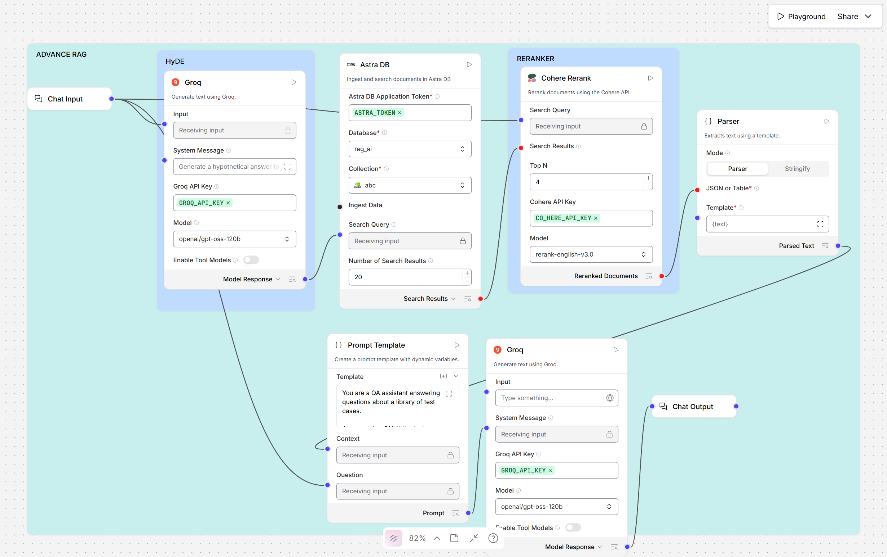
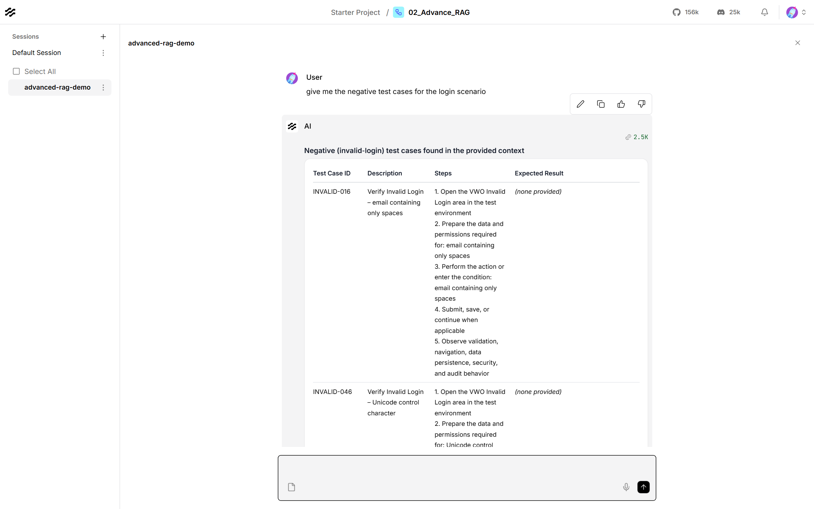
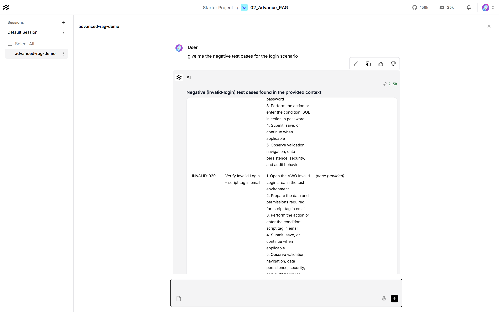

# Advanced RAG in Langflow (HyDE + Cohere Rerank)

The [Naive RAG](../../01_Naive_RAG/langflow/) flow with two extra stages that
improve which test cases reach the model, plus a prompt that keeps the answer
grounded in them. It searches the same Astra DB collection of 500 VWO test
cases.



## Contents

| File | What it is |
|---|---|
| [02_Advanced_RAG_langflow.json](02_Advanced_RAG_langflow.json) | The flow. Import it into Langflow |
| [advanced_rag_langflow_flow.png](advanced_rag_langflow_flow.png) | The whole flow on the canvas |
| [advanced_rag_result_question_and_answer.png](advanced_rag_result_question_and_answer.png) | Playground: the question and the start of the answer |
| [advanced_rag_result_answer_continued.png](advanced_rag_result_answer_continued.png) | Playground: further down the same answer |
| [advanced_rag_result_answer.md](advanced_rag_result_answer.md) | The full answer as text |

There is no ingestion in this flow. It reads the collection that the
[Naive RAG flow](../../01_Naive_RAG/langflow/) fills from
[VWO_500_Test_Cases.csv](../../01_Naive_RAG/langflow/data/VWO_500_Test_Cases.csv).

## What makes it "advanced"

Naive RAG embeds the question, takes the closest few chunks and hands them to the
model. That fails in two ways: a short question like *"negative login cases"*
doesn't look much like a stored test case, so the search pulls loosely related
chunks; and the nearest chunks by vector distance are not always the most useful
ones. This flow adds a stage for each.

| Stage | Node | What it does |
|---|---|---|
| **HyDE** (Hypothetical Document Embeddings) | Groq (first) | Writes a 120–180 word *hypothetical answer* to the question. That text, not the question, is used as the search query, because it reads like the documents being searched |
| **Wide search** | Astra DB | Fetches the **20** chunks closest to the hypothetical answer (NVIDIA embeddings, collection `abc`) |
| **Rerank** | Cohere Rerank (`rerank-english-v3.0`) | Re-scores those 20 against the **original question** and keeps the best **4** |
| **Join** | Parser | Joins all 4 into one block of text, separated by `---` |
| **Grounded answer** | Prompt Template → Groq (second) | Answers from those 4 only, citing each Test Case ID |

## What one real run produced

Question: `give me the negative test cases for the login scenario`

**1. HyDE** turned the one-line question into a search query full of the
vocabulary test cases use (excerpt):

> *Negative test cases for a login scenario should cover invalid credentials,
> missing inputs, security attacks, and account state anomalies… Submit a
> username containing SQL injection payloads and script tags… Include whitespace
> padding before or after credentials, overly long strings, and Unicode
> characters…*

**2. Astra DB** returned 20 chunks, nearly all negative cases (`INVALID-…`).

**3. Cohere** kept these 4:

| Rank | Test Case ID | Description |
|---|---|---|
| 1 | INVALID-016 | Verify Invalid Login - email containing only spaces |
| 2 | INVALID-046 | Verify Invalid Login - Unicode control character |
| 3 | INVALID-038 | Verify Invalid Login - SQL injection in password |
| 4 | INVALID-039 | Verify Invalid Login - script tag in email |

**4. The answer** lists exactly those 4, with their real descriptions and steps.
Where a chunk had no expected result, it says *(none provided)* rather than
inventing one.





The [Naive RAG flow](../../01_Naive_RAG/langflow/), given the same question,
answered with made-up IDs (`N-001`, `N-002`…) and a generic login form.

## The prompt

The Prompt Template, which reaches the second Groq node as its system message:

```text
You are a QA assistant answering questions about a library of test cases.

Answer using ONLY the test cases in the Context below. Do not use outside
knowledge, and never invent test cases, Test Case IDs, steps, test data or
expected results.

Rules:
- Name the Test Case ID for every test case you mention, exactly as it appears
  in the Context (for example INVALID-016).
- Keep each case's description, steps and expected result together. Never
  combine parts of different cases.
- If the Context does not answer the question, say so plainly, then give
  whatever related cases it does contain.
- The Context holds only the few most relevant cases, not the whole library.
  Never say or imply your list is complete.
- Present several cases as a table with the columns: Test Case ID, Description,
  Steps, Expected Result.

Context:
{Context}

Question:
{Question}
```

## Requirements

| Thing | Notes |
|---|---|
| Langflow 1.12.4 | Built and tested on this version |
| A filled Astra DB collection | Ingest the VWO test cases with the [Naive RAG flow](../../01_Naive_RAG/langflow/) first |
| Astra application token | Langflow global variable `ASTRA_TOKEN` |
| Groq API key | Free from [console.groq.com](https://console.groq.com). Global variable `GROQ_API_KEY` |
| Cohere API key | Free trial key from [dashboard.cohere.com](https://dashboard.cohere.com). Global variable `CO_HERE_API_KEY` |

## Setup

1. Run the ingestion part of the [Naive RAG flow](../../01_Naive_RAG/langflow/)
   once, so the collection holds the test cases.
2. In Langflow, go to **Settings → Global Variables** and add `ASTRA_TOKEN`,
   `GROQ_API_KEY` and `CO_HERE_API_KEY`, all of type **Credential**.
3. **New Flow → Import** and pick
   [02_Advanced_RAG_langflow.json](02_Advanced_RAG_langflow.json).
4. In the **Astra DB** node, select your own **Database** and **Collection**:
   the same one the Naive RAG flow ingested into.

## Usage

Open **Playground** and ask a question about the test cases, for example:

- `give me the negative test cases for the login scenario`
- `which tests cover SQL injection?`
- `what are the steps for INVALID-024?`

Each answer covers at most 4 test cases, the reranker's **Top N**. For broad
questions like "all negative cases", raise **Top N** on the Cohere Rerank node to
about 10.

## Troubleshooting

| Symptom | Cause and fix |
|---|---|
| The answer only ever mentions one test case | The node between Cohere Rerank and the Prompt must be a **Parser** (template `{text}`). A **Type Convert** node set to *Message* keeps only the first result and drops the rest |
| The answer invents IDs or uses generic examples like `user@example.com` | The Prompt Template has lost its instructions. Restore the prompt above |
| `The model … does not exist or you do not have access to it` from Groq | Groq retired that model. Langflow's list is out of date, so pick a current one such as `openai/gpt-oss-120b` in **both** Groq nodes |
| `_ssl.c … handshake operation timed out` on Astra DB | A network blip. Send the question again |
| Cohere returns an authentication error | Check `CO_HERE_API_KEY` in Global Variables. Trial keys are rate-limited |
| Every answer says the context doesn't cover the question | The collection is empty. Run the Naive RAG ingestion first (Setup step 1) |
