# RAG Explorer

A local RAG pipeline with its lid off. Point it at a PDF and it shows you every
stage instead of just the answer: the text coming out of the PDF, the chunks it
gets cut into, the 768-dimensional vector each chunk becomes, the similarity
score that wins a chunk a place in the top-3, and the exact prompt the language
model receives.

Two sliders drive the whole thing — **chunk size** and **overlap**. Move one,
watch the chunk map redraw and the search ranking reshuffle. That is the point of
the app: those two numbers decide more about a RAG system's answer quality than
the choice of model does, and here you can feel it rather than read about it.

Everything except the final answer runs on your machine. The PDF is never
uploaded; the embedding model runs in-process; the vector database is a local
file. Only the retrieved excerpts leave, in the prompt sent to Groq.

## Contents

| Path | What it is |
|---|---|
| [server/pdf.js](server/pdf.js) | Stage 1–2: PDF → lines → normalised text, with a per-page report of every repair |
| [server/chunker.js](server/chunker.js) | Stage 3: the chunker the sliders drive |
| [server/embeddings.js](server/embeddings.js) | Stage 4: Nomic embeddings, running locally via ONNX |
| [server/store.js](server/store.js) | Stage 5: the LanceDB vector store |
| [server/llm.js](server/llm.js) | Stage 7: prompt assembly and the Groq call |
| [server/index.js](server/index.js) | The API that wires the stages together |
| [web/src/App.jsx](web/src/App.jsx) | The shell, the sliders, and the tab state |
| [web/src/Logo.jsx](web/src/components/Logo.jsx) | The RAG Explorer mark (also inlined as the favicon in `index.html`) |
| [web/src/styles.css](web/src/styles.css) | The whole visual layer — one stylesheet, no framework |
| [web/src/components/IngestTab.jsx](web/src/components/IngestTab.jsx) | Pipeline timings, the document map, the chunk grid |
| [web/src/components/SearchTab.jsx](web/src/components/SearchTab.jsx) | Top-K with weights, and every chunk's score |
| [web/src/components/ChatTab.jsx](web/src/components/ChatTab.jsx) | The assembled prompt and the grounded answer |
| `data/` | Drop your PDF here. The first one found is indexed |
| `screenshots/` | The images used in the walkthrough below |
| [plan.md](plan.md) | Why it is built this way, and what was measured |

## The stack

| Stage | Choice | Runs where | Cost |
|---|---|---|---|
| PDF text | `pdfjs-dist` | local | free |
| Embeddings | `nomic-embed-text-v1.5`, Q8 ONNX, via `@huggingface/transformers` | local, in-process | free |
| Vector DB | **LanceDB**, embedded | local file (`.lancedb/`) | free |
| Generation | `openai/gpt-oss-120b` via Groq | Groq API | needs a key |

The embedding model downloads once on first run (~132 MB into `.models/`) and is
offline after that. LanceDB is embedded — it runs inside the Node process the way
SQLite does, so there is no server to start, no Docker image and no port to
clash. See [plan.md](plan.md) for why Chroma and Qdrant were tried first and did
not survive contact with this machine.

## Requirements

- **Node 20+** (built and tested on 24.19).
- A **Groq API key**, free from [console.groq.com](https://console.groq.com) —
  needed only for the Chat tab. Ingestion and search work without one.
- ~400 MB of disk for dependencies and the model weights.
- Windows, macOS or Linux. Nothing here needs Docker or Python.

## Setup

```bash
cd 10_RAG/RAG_Explorer

# 1. dependencies, server and web
npm run install:all

# 2. your Groq key
echo "GROQ_API_KEY=gsk_your_key_here" > .env

# 3. your PDF
#    put any PDF in data/ — the first one found is the one indexed
```

If `npm install` warns that install scripts were blocked, approve the two that
compile native bindings, then install again:

```bash
npm install-scripts approve onnxruntime-node protobufjs
npm install
```

## Running it

```bash
npm run dev
```

That starts the API on **5174** and the UI on **5173**. Open
<http://localhost:5173>.

The first ingest takes ~20 seconds longer than later ones, because it downloads
the embedding model. Subsequent re-ingests of a 7-page PDF take about 5 seconds,
nearly all of it embedding.

To run the halves separately:

```bash
npm run server   # API only, port 5174
npm run web      # UI only, port 5173 (proxies /api to 5174)
```

## Using it

Colour is load-bearing in this interface rather than decorative, so it is worth
knowing the code: **violet** is the brand and the chunking machinery, **cyan** is
retrieval (page tags, query vectors, citations), **amber** is overlap — text that
deliberately lives in two chunks — and **emerald** marks a winner, the rank-1
hit. The sun/moon button top-right switches between the dark and light palettes;
dark is the default.

### Tab 1 — Ingest: the PDF becomes vectors

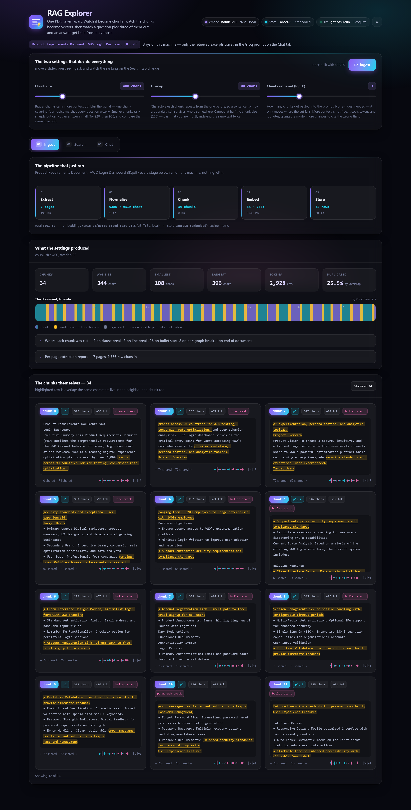

Five stages, each reporting what it actually did and how long it took. Nothing
here is a claim — the numbers come back from the run you just triggered.

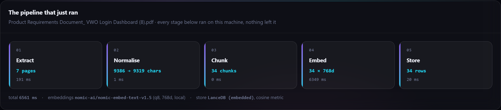

Extract pulls 7 pages out of the PDF. Normalise rebuilds lines from glyph
coordinates and repairs ligature splits and footnote markers. Chunk cuts the text
using your slider settings. Embed turns each chunk into 768 floats, locally.
Store writes them to LanceDB. On a 7-page document the whole thing takes about
ten seconds, nearly all of it embedding.

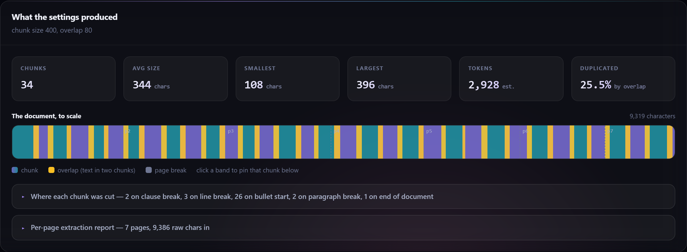

This is the picture worth lingering on: the whole document as one band, every
chunk drawn in place. The alternating violet and cyan blocks are chunks, so you
can count them. **The amber slivers are overlap** — text that deliberately exists
in two chunks at once, so a sentence cut by a boundary still survives whole
somewhere. The dashed lines are page breaks, and chunks visibly cross them,
because the chunker works on the document, not on pages. Click any band to pin
that chunk. The stat row above reports that 25.5% of the document is duplicated
at these settings — that is the price of the overlap, made explicit.

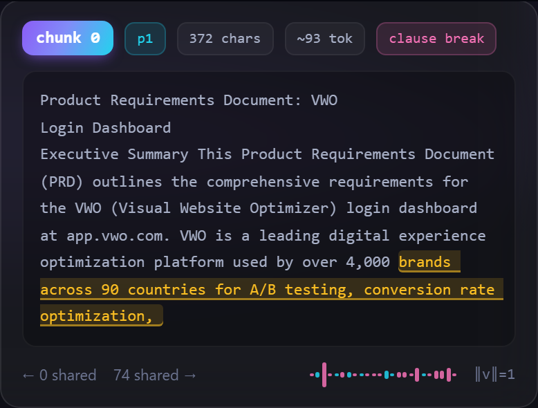

Each chunk card carries its page, character count, token estimate, and the
boundary the chunker cut on (`clause break`, `bullet start`, `paragraph break`).
The amber highlight inside the text is the overlap again, in the same colour as
the map — the tail shared with the next chunk. The small cyan-and-pink trace at
the bottom is the first 24 of its 768 dimensions: that is what "embedding" means
concretely. `‖v‖=1` confirms the vector is normalised, which is why cosine
similarity is just a dot product.

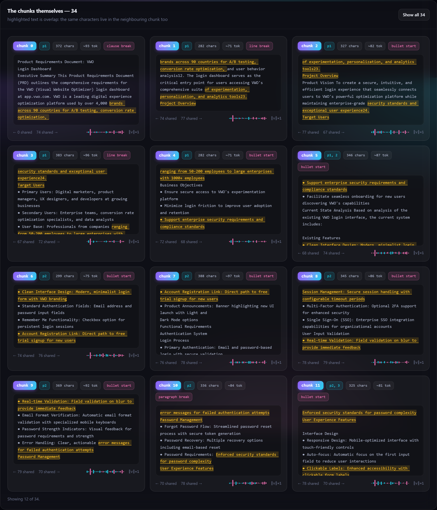

### Tab 2 — Search: which chunks win, and by how much

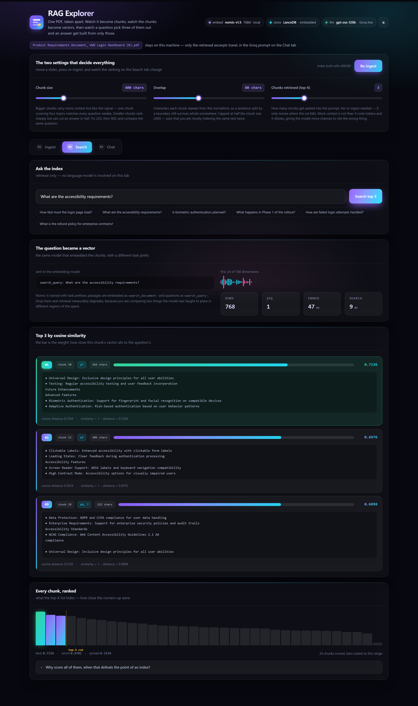

No language model is involved on this tab at all. This is pure arithmetic, and
separating it from generation is the point — most people assume retrieval is the
clever part when it is the simple part.

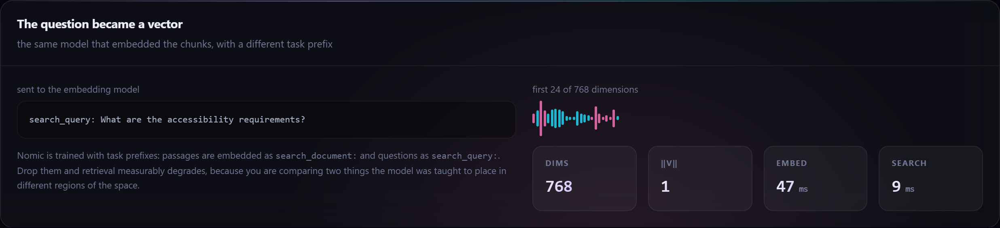

The question goes through the same model as the chunks, but with a different task
prefix: passages are embedded as `search_document:` and questions as
`search_query:`. Nomic is trained that way, and dropping the prefixes measurably
degrades retrieval, so the app shows the exact string it sent.

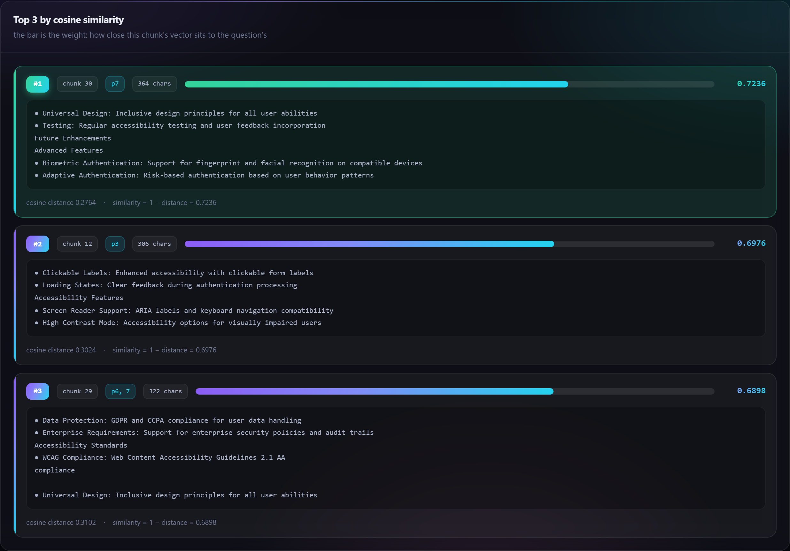

**These are the weights.** Each bar is the cosine similarity between that chunk's
vector and the question's — how close the two sit in 768-dimensional space. The
rank-1 hit is green. Each result also shows the raw `cosine distance` LanceDB
returned and the conversion `similarity = 1 − distance`, so the store's actual
output is on screen rather than implied.

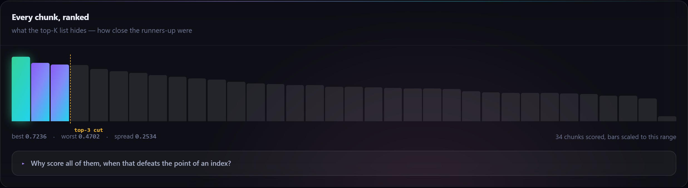

This chart is the one a top-3 list hides. Every chunk is scored and sorted, with
the top-3 cut drawn in amber. It answers the question that matters: *did the
winners actually stand out?* Here the best is 0.7236 and the worst 0.4702 — a
spread of 0.2534, with the green bar clearly ahead. A flat chart instead would
mean the chunks are too large or too alike and the cut-off is close to arbitrary,
and the fix for that is the chunk-size slider, not a better model. Bars are
scaled to the actual score range, because cosine scores on real prose occupy a
narrow band and a 0–1 axis would render every bar identically.

### Tab 3 — Chat: the chunks become an answer

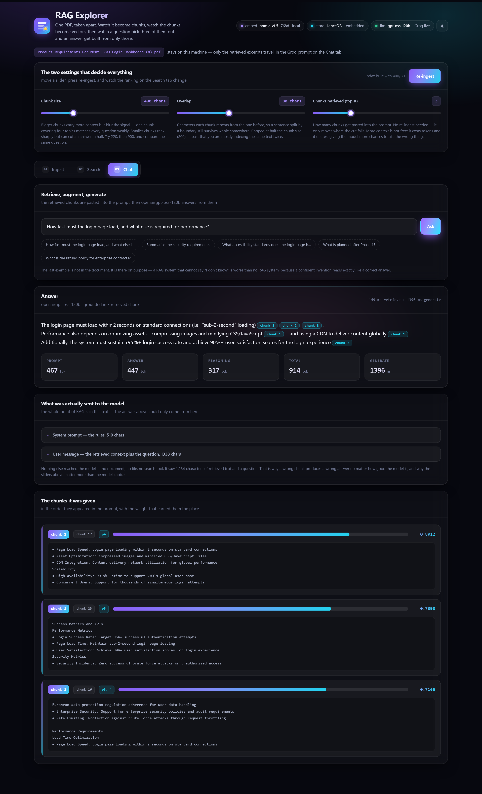

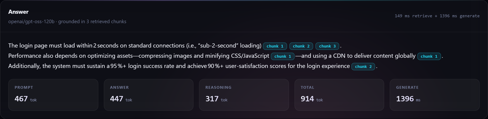

The answer is grounded in the retrieved chunks and every factual sentence carries
a citation chip. Click one and it highlights the chunk it came from. The token
counts are the real usage returned by Groq.

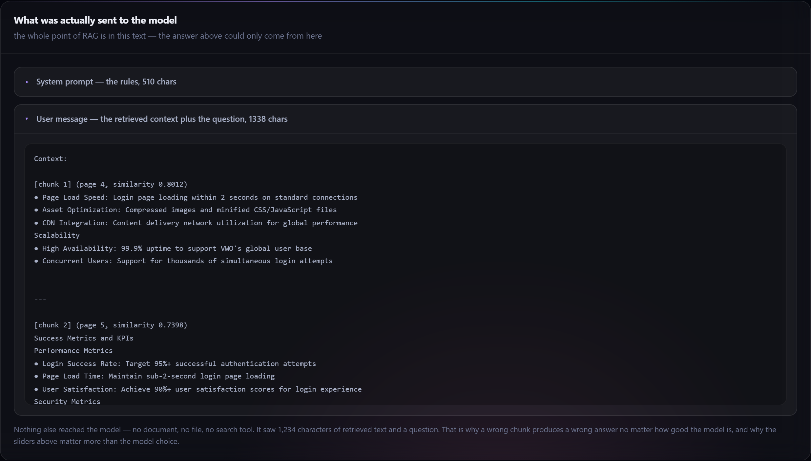

**This is the part most demos hide, and it is the whole idea.** Expand the user
message and you see exactly what the model received: the retrieved chunks, each
labelled with its page and similarity, then the question. Nothing else reached
the model — no document, no file, no search tool. That is why a wrong chunk
produces a wrong answer no matter how good the model is, and why the two sliders
matter more than the choice of model.

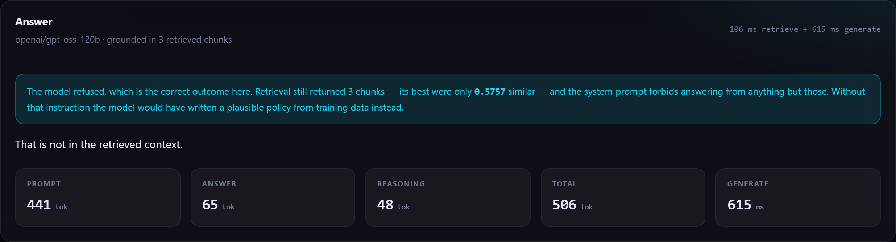

Ask something the document does not cover and the model says so. Retrieval still
returned three chunks — it always returns *something* — but at ~0.57 similarity
rather than ~0.80, and the system prompt forbids answering from anything but
those. A RAG system that cannot say "I don't know" is worse than no RAG system,
because a confident invention reads exactly like a correct answer.

### Light mode

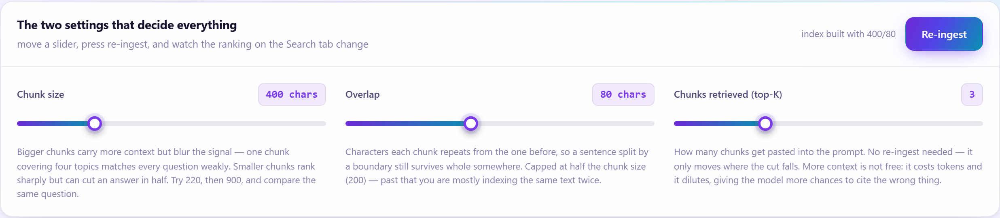

The sun/moon button in the masthead switches palettes. Both are fully supported;
dark is the default and the one the design is tuned for.

### The experiment worth running

1. Open the **Search** tab and ask *"What are the accessibility requirements?"*
2. Note which chunk ranks #1 and what the spread looks like.
3. Drag **chunk size** down to ~220 and let it re-ingest.
4. Ask the same question again.

On the sample PRD the correct chunk moves from rank 2 to rank 1 and its
similarity rises from 0.667 to 0.725, because a 700-character chunk covering four
topics matches everything weakly while a 220-character chunk about accessibility
matches an accessibility question strongly. Then push chunk size up to 1200 and
watch retrieval get vague again.

## Troubleshooting

**`Cannot reach the API` in the browser** — the API is not running. `npm run
server` in a second terminal, or use `npm run dev` which starts both.

**First ingest hangs for a minute** — it is downloading the embedding model from
Hugging Face. Watch the server terminal. If it times out, the download is
resumable: just re-ingest.

**`No PDF found in .../data`** — `data/` is empty. Drop a PDF in. Only the first
one found is indexed.

**Chat tab says no `GROQ_API_KEY`** — the key is missing from `.env`, or the
server was started before you added it. Restart the server; `.env` is read once
at boot.

**Chat returns a Groq 400 about the model** — `openai/gpt-oss-120b` was retired
or renamed. Change `MODEL` at the top of [server/llm.js](server/llm.js).

**Every chunk is cut on `word space`** — the extractor found no structure in
your PDF, usually because it is a scan rather than real text. Chunking still
works, but boundaries will land mid-sentence. A scanned PDF needs OCR first;
`pdfjs-dist` reads text, it does not read pictures of text.

**Similarity scores all look the same (spread under ~0.05)** — chunks are too
large or too alike. Pull chunk size down. A flat distribution means the
retriever cannot really distinguish them and the top-K cut is close to arbitrary.

**`Unsupported Windows architecture` from a vector DB** — not this one. LanceDB
ships x64 and ARM64 prebuilds; if you swapped in Chroma's npm CLI, that one is
ARM64-only on Windows.

## What this is not

It indexes one document, holds the chunk list in server memory, and rebuilds the
whole index on every change. That is deliberate — it keeps the pipeline legible.
A production system would add incremental indexing, a persistent job queue,
hybrid (keyword + vector) retrieval, a reranker, and evaluation against a
labelled question set. None of that would make the mechanism clearer, which is
this app's only job.
