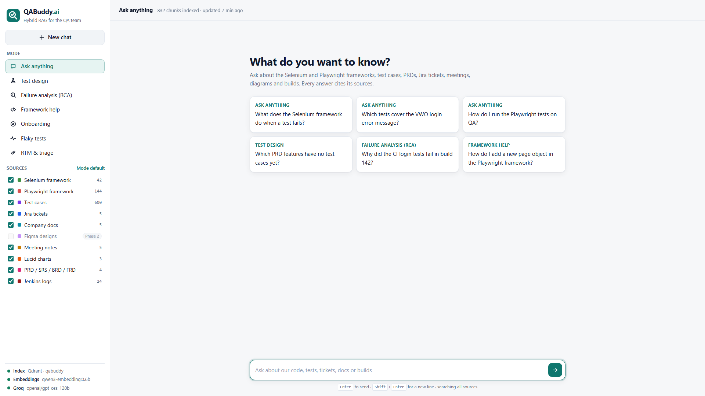
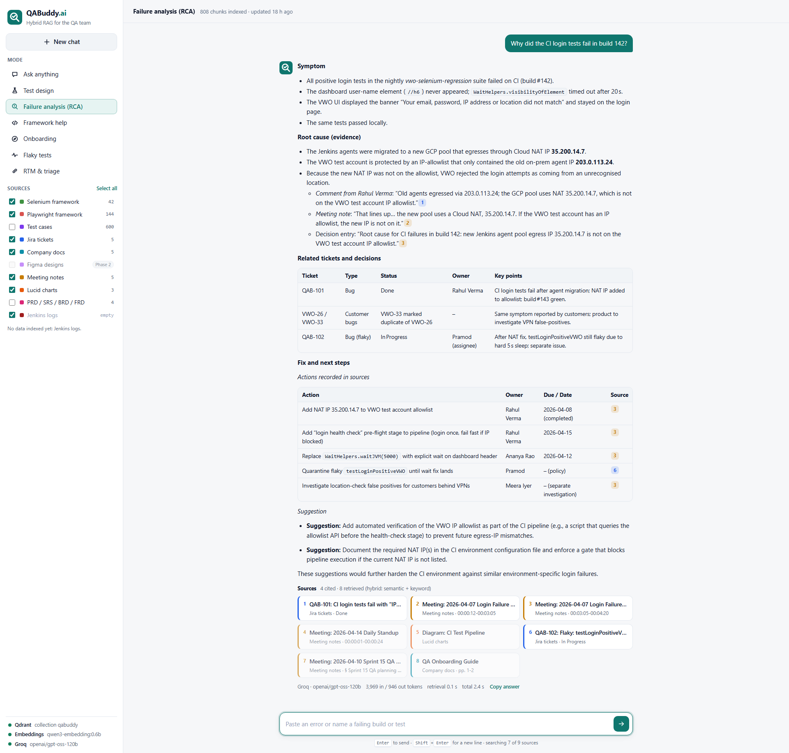

# QABuddy.ai

A self-hosted, multi-source **hybrid RAG** assistant for QA engineers. Ask one question and get one answer,
grounded in your Selenium and Playwright frameworks, test case library, PRDs, Jira tickets, meeting notes,
diagrams and Jenkins results, with every statement linked to the file, row, page, ticket or build it came from.

- **Embeddings:** [Qwen3-Embedding-0.6B](https://huggingface.co/Qwen/Qwen3-Embedding-0.6B) (Apache 2.0), served locally by Ollama
- **Vector database:** [Qdrant](https://qdrant.tech) (Apache 2.0), dense + BM25 sparse vectors in one collection
- **Retrieval:** semantic and keyword search in one round trip, fused with Reciprocal Rank Fusion
- **Answers:** any OpenAI-compatible LLM; Groq `openai/gpt-oss-120b` by default, or a local model through Ollama

**Live demo:** https://qabuddy-vishnudeep-jayam.vercel.app (free Vercel deployment, see [Deploy to Vercel](#deploy-to-vercel-free))

Design decisions and their reasons (embedding model, database, chunk sizes, preprocessing, architecture,
Phase 2) are in [plan.md](plan.md).





### Screenshots

Every question below is one of the examples on the home screen, answered by Groq `openai/gpt-oss-120b`
over the indexed data. Each answer took 2-5 seconds and about 3,000-4,600 prompt tokens.

| Screenshot | Mode | Question |
|---|---|---|
| [01-home](screenshots/01-home.png) | | Home: modes, sources with chunk counts, example questions, service status |
| [02-ask-anything-test-failure](screenshots/02-ask-anything-test-failure.png) | Ask anything | What does the Selenium framework do when a test fails? |
| [03-test-design-prd-gaps](screenshots/03-test-design-prd-gaps.png) | Test design | Which PRD features have no test cases yet? |
| [04-rca-build-142](screenshots/04-rca-build-142.png) | Failure analysis (RCA) | Why did the CI login tests fail in build 142? |
| [05-framework-help-page-object](screenshots/05-framework-help-page-object.png) | Framework help | How do I add a new page object in the Playwright framework? |
| [06-onboarding](screenshots/06-onboarding.png) | Onboarding | I'm new. How do we work as a QA team? |
| [07-flaky-tests](screenshots/07-flaky-tests.png) | Flaky tests | Which tests are flaky right now and why? |
| [08-rtm-triage-vwo-26-33](screenshots/08-rtm-triage-vwo-26-33.png) | RTM & triage | Triage VWO-26 and VWO-33 |
| [09-source-drawer](screenshots/09-source-drawer.png) | Framework help | A citation opened: the exact chunk, its rank in each search, and a GitHub link |
| [10-dark-mode](screenshots/10-dark-mode.png) | Ask anything | Which tests cover the VWO login error message? (dark theme) |
| [11-mobile-home](screenshots/11-mobile-home.png), [12-mobile-menu](screenshots/12-mobile-menu.png) | | Phone layout and its settings menu |
| [00-rca-build-142-chrome-window](screenshots/00-rca-build-142-chrome-window.png) | Failure analysis (RCA) | The same question in a desktop Chrome window |

## How it works

```mermaid
flowchart LR
    subgraph Sources["data/ (10 sources)"]
        TC[00 Test cases<br/>CSV / XLSX]
        JI[01 Jira<br/>exports + MCP sync]
        CD[02 Company docs<br/>PDF / MD / DOCX]
        MN[03 Meetings<br/>VTT / SRT / TXT]
        LC[04 Lucid charts<br/>CSV / JSON / TXT]
        PR[05 PRD SRS BRD FRD<br/>PDF]
        JL[07 Jenkins<br/>logs + JUnit / TestNG / Playwright]
        SC[08 Source code<br/>Selenium + Playwright repos]
    end
    Sources --> L[Loaders<br/>parse, clean, mask secrets,<br/>chunk by structure]
    L --> E[Qwen3-Embedding-0.6B<br/>via Ollama]
    L --> S[BM25 sparse vectors<br/>code-aware tokenizer]
    E --> Q[(Qdrant<br/>dense + sparse)]
    S --> Q
    U[QA engineer] --> W[Web app / CLI]
    W --> R[Hybrid retrieval<br/>semantic + keyword, RRF]
    Q --> R
    R --> P[Grounded prompt<br/>top chunks within a token budget]
    P --> G[LLM<br/>Groq or Ollama]
    G --> W
```



## Quick start (Windows, local)

Needs Python 3.11 and [Ollama](https://ollama.com). Docker is not needed; Qdrant runs as a native binary.

```powershell
cd QA_BUDDY.Ai
py -3.11 -m venv .venv
.venv\Scripts\python -m pip install -r requirements.txt
ollama pull qwen3-embedding:0.6b
copy .env.example .env          # then set GROQ_API_KEY in .env

# Starts Qdrant, indexes the data folders, starts the app and opens http://127.0.0.1:8000
powershell -ExecutionPolicy Bypass -File scripts\start_local.ps1 -Ingest
```

Next time, run the script without `-Ingest`; re-index only when data changes. Re-indexing is
incremental: unchanged files are skipped, and unchanged chunks reuse their cached embeddings. To re-index
every hour without thinking about it, turn on [auto-ingestion](#auto-ingestion-every-hour).

Without `GROQ_API_KEY` the app still works: it shows the best-matching sources instead of a written answer.

## Run on a server (DigitalOcean droplet or any VPS)

A 4 vCPU / 8 GB droplet runs everything, including the embedding model on CPU.

```bash
git clone <this repo> && cd QA_BUDDY.Ai
cp .env.example .env            # set GROQ_API_KEY, QABUDDY_USERNAME, QABUDDY_PASSWORD
# put the data folders next to this folder (../data), or set QABUDDY_DATA_PATH
docker compose up -d --build
docker compose run --rm qabuddy python -m qabuddy ingest

# Public HTTPS with an automatic certificate: point a DNS name at the droplet, then
echo "QABUDDY_DOMAIN=qabuddy.example.com" >> .env
docker compose --profile https up -d
```

All containers restart automatically (`restart: unless-stopped`), so the app stays up 24x7 and survives reboots.
Without the `https` profile the app listens on `127.0.0.1:8000` only. To re-index every hour, install
[deploy/qabuddy.cron](deploy/qabuddy.cron) (see [Auto-ingestion](#auto-ingestion-every-hour)).

## Deploy to Vercel (free)

Vercel's free Hobby plan can host a read-only QABuddy. It runs no Qdrant and no Ollama, so:

- The API runs as one Python function that needs five packages; the UI is served from Vercel's CDN.
- The index is exported from Qdrant to a 3.6 MB snapshot, which the function searches in memory with the
  same scoring. The evaluation results are the same as with Qdrant.
- Answers come from Groq. Your key is stored as an encrypted Vercel environment variable.
- Questions are embedded with the same Qwen3-Embedding-0.6B model through Vercel's
  [AI Gateway](https://vercel.com/docs/ai-gateway), which accepts the deployment's own OIDC token. It has free
  credits every 30 days, but Vercel asks for a card on file before it releases them. Until then, the example
  questions still get full hybrid search, because they are embedded at deploy time, and other questions use
  keyword search. The sidebar shows which applies.

```powershell
npm i -g vercel; vercel login
.venv\Scripts\python scripts\deploy_vercel.py --project qabuddy-vishnudeep-jayam
```

The project name becomes `<name>.vercel.app` if it is free. Run the script again after `ingest` to publish
new data. Ingestion, the Jira sync and Ollama stay on your machine or server.

## Data folders

QABuddy reads the folders in `../data` (set `QABUDDY_DATA_DIR` to change it). The mapping is in
[config/sources.yaml](config/sources.yaml).

| # | Source | Folder | Formats | How it is chunked |
|---|---|---|---|---|
| 1 | Selenium framework | `08_Source_Codes/ATB13xSeleniumAdvanceFramework` | Java, XML, properties, Markdown, XLSX | Syntax tree (tree-sitter): whole methods/classes |
| 2 | Playwright framework | `08_Source_Codes/AdvancePlaywrightFramework1x` | TypeScript, JSON, YAML, Markdown | Syntax tree: whole functions and `test()` blocks |
| 3 | Test cases | `00_TestCases` | CSV, XLSX | One row = one chunk |
| 4 | Jira tickets | `01_Jira_Ticket` + MCP sync | JSON, CSV, printable view (.md/.txt/.html) | One ticket = one chunk |
| 5 | Company docs | `02_Company_Documents` | PDF, Markdown, DOCX, TXT | By heading section |
| 6 | Figma designs | `06_Figma_Desings` | Phase 2 | |
| 7 | Meeting notes | `03_Meeting_Notes` | VTT, SRT, TXT, MD, PDF, DOCX | By speaker turn; notes by heading |
| 8 | Lucid charts | `04_Lucid_Charts` | CSV (shape data), JSON, TXT | Per diagram page: shapes and connections |
| 9 | PRD / SRS / BRD / FRD | `05_PRD_SRS_BRD_FRDs` | PDF, DOCX, Markdown | By heading section |
| 10 | Jenkins logs | `07_Jenkins_Logs` | console logs, JUnit/TestNG XML, Playwright JSON | Build summary, failure windows, per failed test |

Files whose names start with `_README` are notes about a folder and are not indexed. Passwords, tokens and
keys are masked during ingestion, so they never reach the index or the LLM.

To add another repository, clone it into `08_Source_Codes` and add an entry to `config/sources.yaml`.

## Auto-ingestion (every hour)

Built in, and off until you turn it on. Each run:

1. pulls new commits into the repositories in `08_Source_Codes` (`git pull --ff-only`);
2. syncs Jira over MCP, if `JIRA_JQL` and a [Jira MCP server](#jira-over-mcp) are configured;
3. indexes what changed: new and edited files are embedded, deleted files are removed, the rest is skipped.

Turn it on in one of two ways (not both):

| Where | How |
|---|---|
| In the app (Windows or any machine) | Set `QABUDDY_AUTO_INGEST_MINUTES=60` in `.env` and restart the app. The first run starts 30 seconds after launch, then one runs every hour. The sidebar shows an **Auto-ingest** row with the next run time; hover it for the last run's result |
| Cron on a Linux server | Add the line for your setup from [deploy/qabuddy.cron](deploy/qabuddy.cron) with `crontab -e`. The Docker line pulls the repositories on the host, because the container mounts the data read-only |

`python -m qabuddy refresh` runs the same steps once, by hand.

Only one ingestion runs at a time (`storage/ingest.lock`), so a slow run, the next hourly run and a manual
`ingest` never overlap; the one that finds the lock taken is skipped. A failed step, such as a `git pull`
without network, is recorded and the rest of the run still goes ahead. The last run is saved to
`storage/auto_ingest.json`, and the app logs each run to `storage/web.log`. With nothing changed, a run takes
under 10 seconds.

## Commands

| Command | What it does |
|---|---|
| `python -m qabuddy ingest` | Index all sources (incremental). `--source jira` for one source, `--rebuild` to start over |
| `python -m qabuddy refresh` | `git pull` the repositories, sync Jira, then index what changed: one run of the [auto-ingestion](#auto-ingestion-every-hour) |
| `python -m qabuddy serve` | Start the web app on `QABUDDY_HOST:QABUDDY_PORT` |
| `python -m qabuddy ask "question"` | Answer in the terminal, with sources |
| `python -m qabuddy search "query" --mode keyword` | Retrieval only (`hybrid`, `semantic` or `keyword`) |
| `python -m qabuddy sync-jira --jql "project = VWO"` | Fetch tickets over MCP, then index them |
| `python -m qabuddy stats` | Chunks per source |
| `python -m qabuddy eval --verbose` | Retrieval quality on [eval/questions.yaml](eval/questions.yaml) |

The API is documented at `/api/docs` while the app runs.

## Jira over MCP

QABuddy talks to any MCP server with a JQL search tool. The defaults match
[mcp-atlassian](https://github.com/sooperset/mcp-atlassian) (`jira_search`).

1. In `.env`, set `JIRA_URL`, `JIRA_USERNAME`, `JIRA_API_TOKEN` and `JIRA_JQL`.
2. Connect the server one of two ways:
   - **HTTP:** run `docker compose --profile jira up -d` and set `JIRA_MCP_URL=http://mcp-atlassian:9000/mcp`
   - **stdio:** set `JIRA_MCP_COMMAND=uvx` and `JIRA_MCP_ARGS=mcp-atlassian` (needs [uv](https://docs.astral.sh/uv/))
3. Run `python -m qabuddy sync-jira`.

Each ticket is saved to `storage/jira_mcp/<KEY>.json` and indexed with the files in `01_Jira_Ticket`.

## Configuration

Everything is set through `.env`; see [.env.example](.env.example) for the full list.

| Variable | Default | |
|---|---|---|
| `GROQ_API_KEY` / `LLM_API_KEY` | | Key for the LLM endpoint |
| `LLM_BASE_URL`, `LLM_MODEL` | Groq, `openai/gpt-oss-120b` | Any OpenAI-compatible endpoint |
| `EMBED_MODEL` | `qwen3-embedding:0.6b` | Changing it needs `ingest --rebuild` |
| `TOP_K`, `CONTEXT_TOKENS` | `8`, `4000` | How many chunks reach the LLM, and their token budget |
| `RERANKER` | `none` | `cohere` reranks the hybrid results (needs `COHERE_API_KEY`) |
| `QABUDDY_AUTO_INGEST_MINUTES` | `0` (off) | Re-index every N minutes while the app runs; `60` = every hour |
| `QABUDDY_AUTO_GIT_PULL` | `true` | Pull new commits into the source repositories before each automatic run |
| `QABUDDY_USERNAME`, `QABUDDY_PASSWORD` | | Require a login (HTTP Basic) |

## Tests

```powershell
.venv\Scripts\python -m pip install -r requirements-dev.txt
.venv\Scripts\python -m pytest tests
```

The tests cover every loader, the BM25 encoder, secret masking, RRF fusion, citations, the API (with a fake
retriever and LLM), the Jira MCP client against a fake MCP server over stdio, and the auto-ingestion: its
schedule, the lock across processes, and `git pull` against a local repository. None of them need Qdrant,
Ollama or an API key.

## Troubleshooting

| Symptom | Fix |
|---|---|
| "Qdrant not reachable" in the sidebar | Start it: `scripts\start_local.ps1`, or `docker compose up -d qdrant` |
| "Model qwen3-embedding:0.6b is not pulled" | `ollama pull qwen3-embedding:0.6b` |
| Answers list sources but no text | No LLM key: set `GROQ_API_KEY` in `.env` and restart the app |
| `Model ... is not available` | The provider retired it; set `LLM_MODEL` to a current model |
| "rate limiting requests (429)" | Free Groq keys allow only a few questions per minute (about 4,000 tokens each). QABuddy waits and retries once; for a team, use a paid Groq tier or a local model (`LLM_BASE_URL`) |
| A source shows "empty" | Its folder has no supported files yet; add them and run `ingest` |
| Ingestion is slow | Embedding runs on CPU: 60-100 tokens/s on a 2-core laptop, so the first full run of ~800 chunks takes 45-65 minutes. Later runs only embed changed chunks (a full re-chunk took 28 s) |
| "holds 1024-dim vectors but the embedding model gives N" | You changed `EMBED_MODEL`; run `ingest --rebuild` |
| "Another ingestion is running" | An hourly run or another `ingest` holds `storage/ingest.lock`. Wait for it to finish; the lock is released when that process ends, even if it crashed |
| The Auto-ingest row turns amber | Hover it for the last run. Usually a `git pull` could not reach GitHub; the files were still indexed, and the next run pulls again |
