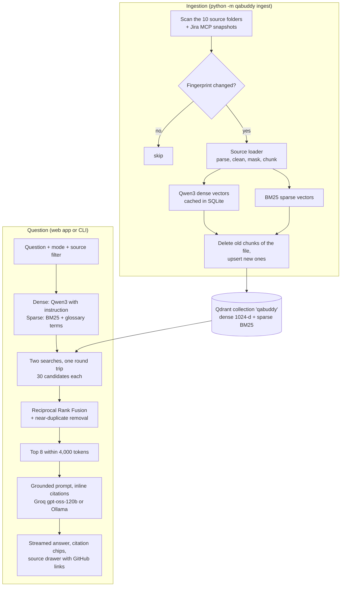

# QABuddy.ai: plan and design decisions

This document answers the five decisions the build brief asked for (embedding model, vector database, chunk
size and overlap, preprocessing, architecture), shows the folder structure for the 10 sources, and covers
Phase 2: hourly auto-ingestion is built, the rest is planned. The [README](README.md) covers running it.

## 1. How I approached it

Four facts about the problem drove every decision:

1. **The data is heterogeneous.** Java and TypeScript code, 5,000-row test case sheets, PDFs, meeting
   transcripts, Jira tickets, diagrams and build logs each have a different natural unit (a method, a row, a
   section, a speaker turn, a ticket, a build). Cutting them all into fixed 1,000-character pieces, as
   [01_Naive_RAG](https://github.com/jayamvishnudeep/RAG/tree/main/01_Naive_RAG) does, splits test cases in half and separates a method from its class.
   So every source gets its own loader that splits on its own structure.
2. **QA questions are full of exact identifiers.** `WING-LOGIN-TC-042`, `QAB-101`, `RetryAnalyzer`,
   `testLoginPositiveVWO`, "build 142". Dense embeddings capture meaning but are weak at exact tokens; BM25 is
   the opposite. So retrieval is **hybrid**: both searches, fused.
3. **Answers must be checkable.** A QA lead won't trust an unsourced answer about a failing build. So every
   chunk carries the metadata to cite it precisely (file and line range with a GitHub link, CSV row, PDF page
   and section, ticket key, build number), and the prompt forces inline citations.
4. **It runs on a CPU-only droplet, 24x7, cheaply.** That rules out multi-billion-parameter embedding models
   and GPU-only multimodal models, and it makes token efficiency a design goal rather than an afterthought.

## 2. Decision 1: embedding model

**Qwen3-Embedding-0.6B** (Apache 2.0), served by Ollama as `qwen3-embedding:0.6b`.

| Model | Params | Dims | Context | License | Fit here |
|---|---|---|---|---|---|
| **Qwen3-Embedding-0.6B** | 0.6B | 1024 (Matryoshka, down to 32) | 32K | Apache 2.0 | **Chosen.** Strong on code, long context, instruction-aware queries |
| EmbeddingGemma-300M | 0.3B | 768 | 2K | Gemma terms | Fallback: about 3x faster to ingest, slightly weaker on code, 2K context |
| nomic-embed-text v1.5 | 0.14B | 768 | 8K (2K default) | Apache 2.0 | Older and weaker than both above |
| bge-m3 | 0.57B | 1024 | 8K | MIT | Good multilingual model; weaker on code than Qwen3 |
| Qwen3-Embedding-4B / 8B, NV-Embed-v2 | 4-8B | 2560-4096 | 32K | mixed | Better scores, but too slow without a GPU |
| jina-embeddings-v4, ColQwen | 3-4B | multi-vector | | mixed | Embed images too (Figma), but need a GPU: Phase 2 candidates |

Why Qwen3-Embedding-0.6B:

- **Code.** Two of the ten sources are code repositories. Qwen3-Embedding-0.6B scores 75.41 on MTEB-Code,
  ahead of Google's commercial Gemini Embedding (74.66), in a model small enough for a CPU (Qwen3 Embedding
  paper, Table 3; the 8B model reaches 80.68).
- **Context.** 32K tokens means a whole Java class, a long Jenkins stage or a PRD section embeds without
  truncation. EmbeddingGemma stops at 2K.
- **Instruction-aware.** Queries are embedded with a task instruction ("retrieve the code, test cases,
  requirements, tickets, notes or build logs that answer a QA engineer's question"), which Qwen3 was trained
  for; documents are embedded plain.
- **Licence and hosting.** Apache 2.0, runs in Ollama on CPU, about 0.2 s per query.

Measured on the development laptop (2-core i7-6500U, no GPU), on the 100 Wingify test cases, using each test
case's title as the question and its steps and expected result as the document:

| Model | Time per document | Time per query | Correct case ranked 1st | Correct case in top 5 |
|---|---|---|---|---|
| embeddinggemma | 0.36 s | 0.12 s | 78% | 95% |
| qwen3-embedding:0.6b | 1.15 s | 0.19 s | 69% | **97%** |

Both are good enough; the deciding factors were code, context length and licence. Ingestion is a one-off cost
(later runs only embed changed chunks, see section 5), and query time is the same for practical purposes.

## 3. Decision 2: vector database

**Qdrant** (Apache 2.0): one container, or one native binary on Windows.

| | **Qdrant** | Weaviate | Milvus | pgvector | Chroma |
|---|---|---|---|---|---|
| Dense + keyword in one query | Native sparse vectors with server-side IDF | Native BM25 hybrid | Sparse vectors | Hand-built with `tsvector` | Limited |
| Filtering by source | Fast payload indexes, facet counts | Good | Good | SQL | Basic |
| Footprint | One process, ~100 MB at this scale | Heavier | Needs etcd + MinIO | Postgres | Embedded, simplest |
| Licence | Apache 2.0 | BSD-3 | Apache 2.0 | PostgreSQL | Apache 2.0 |

Why Qdrant:

- **Hybrid search in one collection.** Every chunk has a dense vector (Qwen3) and a sparse BM25 vector. Qdrant
  stores the term weights and applies IDF itself at query time (`Modifier.IDF`), so IDF stays correct as data
  is added. Both searches run in one round trip (`query_batch_points`).
- **Payload filters and facets.** Every chunk stores `source`, `source_type` and `doc_id` as indexed keyword
  fields. Filters ("only Jenkins and Jira") are cheap, facets give the per-source counts in the UI, and
  re-indexing a file is a delete-by-`doc_id`.
- **Operations.** A single small process with snapshots for backup fits a single droplet. Weaviate is a close
  second; Milvus is built for a cluster; pgvector needs the keyword side built by hand.

## 4. Decision 3: chunk size and overlap per source

Principles:

- **Split on the source's natural unit first**: a row, a ticket, a method, a section, a speaker turn, a build
  stage. Only a unit that is too big on its own is cut further.
- **Overlap only inside a cut unit.** Two different test cases or two different methods never overlap; that
  would only create duplicate hits. When one section, function or ticket must be cut, the next piece repeats
  the last 10-15% so a sentence or statement split at the boundary is still whole somewhere.
- **Every chunk starts with a context header** (document title and section path, file and line range with the
  enclosing class, ticket key and status, build and stage). A chunk then makes sense alone, which helps both
  search and the LLM.
- **Smaller for prose, larger for code.** Prose retrieves best at a few hundred tokens: bigger chunks dilute
  the vector and cost prompt tokens. Code needs a whole method to be useful, so its limit is higher.

| Source | Unit | Max tokens | Overlap | Why |
|---|---|---|---|---|
| Test cases (CSV/XLSX) | 1 row | 512 | 0 (64 if a row is cut) | A row is a complete test case; typical rows are 150-300 tokens |
| Code (Java, TS/JS) | Whole declarations via tree-sitter, merged up to the limit | 800 (min 80) | 0 (80 if one method is cut) | A method plus its class context answers "how does X work"; tiny pieces (a lone `}`) are merged |
| Config and other code files | Line windows | 800 | 80 | No syntax tree; line numbers kept for citations |
| PRD/SRS/BRD/FRD, company docs | Heading section, small sections merged | 600 (min 60) | 90 (15%) inside a cut section | Requirements are written per section; 600 keeps a feature's text together |
| Meeting transcripts | Speaker turns packed | 450 | 60 (last 1-2 turns) | A question and its answer stay together across a boundary |
| Lucid charts | One page: shapes + connections | 500 | 0 | A diagram page is one idea |
| Jenkins console logs | Build summary; failure windows (error -6/+12 lines, whole stack trace); stage windows | 450 | 45 (10%) | RCA needs the error and its stack trace together; the summary answers "what failed in build N" |
| Test reports (JUnit/TestNG/Playwright JSON) | Summary per report; one chunk per failed or flaky test | 450 | 0 | Per-test history is what flaky-test questions need |
| Jira tickets | 1 ticket: header, description, comments | 700 | 80 if a long ticket is cut | A ticket is one unit; the header (key, status, priority) repeats on every piece |

Tokens are estimated from characters (4 per token for prose, 3.3 for code and logs). All values live in
[config/sources.yaml](config/sources.yaml); changing one re-chunks the affected files on the next `ingest`.

On the current data this gives 832 chunks:

| Source | Chunks | Median tokens | Max tokens |
|---|---|---|---|
| Selenium framework | 42 | 236 | 711 |
| Playwright framework | 144 | 470 | 738 |
| Test cases (600 rows) | 600 | 196 | 221 |
| Jira tickets | 5 | 304 | 439 |
| Company docs | 5 | 434 | 593 |
| Meeting notes | 5 | 392 | 414 |
| Lucid charts | 3 | 379 | 480 |
| PRD | 4 | 486 | 606 |
| Jenkins logs (3 builds, 1 report) | 24 | 204 | 406 |

Test data sheets inside a repository (such as the Selenium framework's `TestData.xlsx`) are indexed as tables
in windows of rows, not one chunk per row, because they are not test cases.

## 5. Decision 4: preprocessing and normalization

**For every source**
- Unicode NFKC (fixes PDF ligatures such as "fi"), invisible characters removed, CRLF to LF, trailing
  whitespace stripped, runs of blank lines collapsed.
- **Secrets masked before anything is stored**: passwords, tokens and API keys in config files, quoted
  secret literals in code, `key=value` secrets anywhere in build logs, spreadsheet columns named password,
  secret, token or API key, bearer tokens, credentials in URLs, and common token formats (AWS, GitHub, Slack,
  JWT, private keys). They never reach Qdrant or the LLM provider. Example: `password=Test@4321` in
  `data.properties` is indexed as `password=***`, and the password column of `TestData.xlsx` as `***`.
- Files whose names start with `_README` (notes about a data folder) are skipped.

**Per source**
- **Test cases:** header aliases recognize the ID and title columns (`Test Case ID`, `Scenario TID`,
  `Issue key`...). Duplicate columns, a "Description" that restates three or more other fields, and long
  values identical on every row (import notes) are dropped. `1. ... | 2. ...` steps become one step per line.
  Compared with writing out every non-empty field, this shrinks the Wingify sheet by 65% and the VWO sheet by
  40% (measured in characters) without losing information.
- **Code:** parsed with tree-sitter; doc comments stay with their declaration; common indentation removed;
  chunks list the methods and tests they define (`Defines: loginToVWOLoginValidCreds(), ...`).
- **PDF:** pypdf layout mode (keeps tables and bullets readable), running headers and footers removed, page
  numbers removed only at page edges, hyphenated line breaks joined, table columns marked with `|`, headings
  detected (`4.1. Experimentation & Testing`) to build the section tree.
- **Logs:** ANSI colour codes and Jenkins console annotations stripped; download progress, `[Pipeline]`
  bookkeeping and blank lines dropped; repeated lines collapsed (`... repeated 37 more times`).
- **Jira:** REST JSON, rich text (Atlassian Document Format), CSV exports with repeated columns, and the
  printable view saved as text all become one ticket layout; dates become ISO `YYYY-MM-DD`.
- **Transcripts:** Teams/Zoom VTT voice tags and SRT cues merged into speaker turns; "Decisions:" and
  "Action items:" lists kept as their own blocks rather than attached to the last speaker.

**Terminology.** [config/glossary.yaml](config/glossary.yaml) maps QA abbreviations and synonyms (TC, POM,
RTM, RCA, flaky/intermittent, login/sign in...). They widen the keyword half of a query at half weight; the
semantic half already understands them. The BM25 tokenizer indexes identifiers both whole and split:
`WING-LOGIN-TC-001` gives `wing-login-tc-001` and `wing`, `login`, `tc`, `001`; `DriverManager` gives
`drivermanager`, `driver`, `manag`. Plain words are stemmed.

**Metadata stored with every chunk:** `text`, `source`, `source_type`, `doc_id`, `title`, `location`,
`url` (GitHub line link or Jira link), source-specific fields (test ID, priority and status; ticket key,
type and status; job, build and stage; language, scope and symbols), chunk index, token estimate and
`indexed_at`.

## 6. Decision 5: architecture, structure and plan



**Modes.** The UI offers seven task modes: Ask anything, Test design, Failure analysis (RCA), Framework help,
Onboarding, Flaky tests, RTM & triage. A mode adds task instructions to the prompt (for example RCA answers
as Symptom, Root cause with evidence, Related tickets, Fix) and preselects the sources that matter (RCA: Jenkins,
Jira, meetings, code, diagrams, docs). The user can change the filter.

**Token efficiency.** About 4-5k prompt tokens per question:
- Only the top 8 fused chunks, capped at 4,000 tokens, reach the model.
- Chunks are pre-trimmed: duplicate columns and log noise are removed at ingest time.
- History is the last three exchanges, with old citation numbers stripped.
- One LLM call per question, with no query rewriting; follow-ups are searched together with the previous
  question instead.
- The UI shows the prompt and completion tokens of each answer.

**Deployment.** [docker-compose.yml](docker-compose.yml) runs Qdrant, Ollama (embedding model only) and the
app with `restart: unless-stopped`. Caddy adds automatic HTTPS (profile `https`), and mcp-atlassian is
optional for Jira (profile `jira`). A 4 vCPU / 8 GB droplet is enough. Without a public domain the app
binds to `127.0.0.1` only; with one, HTTP Basic login is set through `QABUDDY_USERNAME`/`QABUDDY_PASSWORD`.
Back up with Qdrant snapshots. The index can always be rebuilt from `data/`, and the embedding cache makes a
rebuild fast.

**Serverless demo (Vercel).** For a free public demo,
[scripts/deploy_vercel.py](scripts/deploy_vercel.py) publishes a read-only build.
- **Index.** It is exported from Qdrant to a snapshot ([snapshot.py](qabuddy/snapshot.py)) that the API
  function searches in memory with Qdrant's scoring. Cosine similarity drives semantic search; term weight
  times IDF drives keyword search. On the evaluation set it matches Qdrant: semantic 87%, keyword 87%,
  hybrid 100% recall@5.
- **Question embeddings.** They come from the same Qwen3-Embedding-0.6B through Vercel's AI Gateway. The
  example questions are embedded at deploy time with the local model, so they keep full hybrid search even
  without the gateway.
- **What stays local.** Ingestion, the Jira sync and Ollama stay on a machine or server; the demo is
  refreshed by re-running the script.
- **Live demo:** https://qabuddy-vishnudeep-jayam.vercel.app

**Self-hosting the LLM.** Embeddings and the vector database are open source and local. The answer model is
any OpenAI-compatible endpoint. Groq is the default for speed and cost: a cited answer streams back in about
2 seconds. Setting `LLM_BASE_URL` to Ollama (for example `qwen3:8b` on an 8 vCPU / 16 GB droplet, or a GPU
droplet) keeps all data on the server. Two practical notes from testing:
- A free Groq key is rate limited after a few questions per minute. QABuddy waits once and retries, but a
  team needs a paid tier or a self-hosted model.
- A 1B local model (`gemma3:1b`) answered wrongly and without citations, so use at least an 8B model.

**Project structure**

```text
QA_BUDDY.Ai/
├── qabuddy/
│   ├── loaders/          one loader per source kind: code, tabular, jira, documents,
│   │                     transcripts, diagrams, logs (+ base: context, GitHub links)
│   ├── chunking.py       generic splitters with overlap and line numbers
│   ├── text.py           normalization, secret masking, token estimates, glossary
│   ├── sparse.py         BM25 tokenizer and sparse vectors
│   ├── embeddings.py     Qwen3 via Ollama + SQLite cache
│   ├── store.py          Qdrant collection, upserts, hybrid search, facets
│   ├── snapshot.py       read-only in-memory index for serverless hosting (Vercel)
│   ├── ingest.py         incremental ingestion with fingerprints, one run at a time (file lock)
│   ├── auto_ingest.py    hourly refresh: git pull, Jira sync, ingest; the in-app schedule
│   ├── retrieval.py      RRF fusion, deduplication, optional rerank
│   ├── prompts.py        grounded system prompt and the seven modes
│   ├── llm.py            OpenAI-compatible streaming client
│   ├── answer.py         retrieval -> context -> streamed, cited answer
│   ├── jira_mcp.py       MCP client: JQL search, pagination, snapshots
│   ├── api.py            FastAPI: health, config, chat (SSE), search, chunks
│   ├── evaluate.py       recall@k and MRR per retrieval mode
│   └── __main__.py       CLI
├── web/                  chat UI (HTML, CSS, JS; Markdown via vendored marked + DOMPurify)
├── screenshots/          the UI: one answered question per mode, source drawer, dark mode, phone
├── Prompts/              the build briefs this project was built from
├── config/               sources.yaml (the 10 sources, chunk sizes), glossary.yaml
├── eval/questions.yaml   retrieval evaluation set
├── tests/                pytest suite + fixtures + fake Jira MCP server
├── deploy/               Caddyfile (HTTPS reverse proxy), qabuddy.cron (hourly refresh on a server)
├── vercel/               Vercel function entry point, routing and its five-package requirements
├── scripts/              start_local.ps1 (Windows, no Docker), deploy_vercel.py (free demo)
├── Dockerfile, docker-compose.yml, requirements.txt, .env.example
```

## 7. Folder structure for the 10 sources

The team's data lives next to the app in `data/`, one folder per source. The two framework repositories share
`08_Source_Codes`, each as its own source.

```text
data/
├── 00_TestCases/            3. test cases          CSV, XLSX (e.g. VWO_500_Test_Cases.csv)
├── 01_Jira_Ticket/          4. Jira tickets        exports (JSON, CSV, printable view); MCP sync adds storage/jira_mcp/
├── 02_Company_Documents/    5. company docs        PDF, MD, DOCX
├── 03_Meeting_Notes/        7. meetings            VTT, SRT, TXT, MD (transcripts and notes)
├── 04_Lucid_Charts/         8. Lucid charts        CSV shape data, JSON, TXT
├── 05_PRD_SRS_BRD_FRDs/     9. requirements        PDF, DOCX, MD
├── 06_Figma_Desings/        6. Figma (Phase 2)     ER diagrams, user guides, wireframes
├── 07_Jenkins_Logs/        10. Jenkins             console logs, JUnit/TestNG XML, Playwright JSON
│                                                   (JOB/BUILD/console.log or JOB_BUILD.log names the build)
└── 08_Source_Codes/
    ├── ATB13xSeleniumAdvanceFramework/   1. Selenium framework (git clone)
    └── AdvancePlaywrightFramework1x/     2. Playwright framework (git clone)
```

The brief names `PramodDutta/Advance-Playwright-Framework` as source 2; the clone in `08_Source_Codes` is
`AdvancePlaywrightFramework1x`. To use the other repository, clone it into `08_Source_Codes` and point the
`playwright` entry in `config/sources.yaml` at it.

## 8. Phase 2

**Hourly auto-ingestion (built, off by default).** Ingestion was incremental from the start: files are
fingerprinted, unchanged files are skipped, deleted files are removed, embeddings are cached, and every file
is replaced atomically by `doc_id`. [auto_ingest.py](qabuddy/auto_ingest.py) adds the trigger:

1. **The refresh** (`python -m qabuddy refresh`): `git pull --ff-only` in each repository in
   `08_Source_Codes`, then the Jira MCP sync when `JIRA_JQL` is set, then `ingest`. A failed step (no network,
   a diverged branch, Jira down) is recorded and the rest of the run still goes ahead. A stalled pull gives up
   after 20 s below 1 KB/s, or after 60 s at most. Changed files get GitHub links to the new commit; unchanged
   ones keep their old permalinks, which stay valid.
2. **Two ways to schedule it.** A daemon thread in the web app (`QABUDDY_AUTO_INGEST_MINUTES=60`) needs no
   setup on Windows and shows its state in the sidebar. A cron entry ([deploy/qabuddy.cron](deploy/qabuddy.cron))
   suits a server; there it also pulls the repositories on the host, because the container mounts the data
   read-only and has no git. One fixed interval did not need APScheduler. The thread keeps a fixed cadence
   (10:00, 11:00, ...) rather than sleeping an hour after each run, and skips any slot a long run overran.
   It is off by default, so nothing re-indexes until it is switched on, and it never starts on the read-only
   Vercel snapshot.
3. **One run at a time.** `storage/ingest.lock` is an OS file lock (`msvcrt` on Windows, `flock` elsewhere),
   held for the whole refresh and by every `ingest`. The OS releases it when the process ends, even after a
   crash, so a stale lock never blocks the next run. A run that finds it taken is recorded as skipped.
4. **Status.** `storage/auto_ingest.json` keeps the last run (each step, a summary, the duration).
   `/api/health` returns it with the next run time, and the sidebar reloads the chunk counts after each run.

Measured on the 2-core laptop with a 1-minute interval: a run with nothing changed took 7-8 s
(fingerprinting every file, two `git pull`s). A new meeting note was searchable after the next run (18 s, one
chunk embedded), and deleting it removed it from the index on the run after that (7 s). A run while another
process held the lock was skipped. One `git pull` hung on the network; it was cut off at the timeout and the
run still indexed the files, ending as a warning.

Still planned on top of it:
- Pull new Jenkins builds through the Jenkins API (`/job/<name>/lastCompletedBuild/consoleText` and
  `/testReport/api/json`) into `07_Jenkins_Logs/<job>/<build>/`.
- An incremental JQL (`updated >= -65m`) every hour and a full sync with `--prune` nightly; today each run
  syncs the full `JIRA_JQL`.
- A failure alert to Slack `#qa-alerts`.
- Flaky-test history: per-test status per build in a small SQLite table, fed from the test reports, so "is X
  flaky?" can be answered with counts and not only by retrieval.

**Figma designs.** Use the Figma REST API (`GET /v1/files/:key`, `/v1/images/:key`):
- **Wireframes and user guides:** frame names, text layers and component names become one text chunk per
  frame, cited with a deep link to the frame.
- **ER diagrams:** entities and relationships are extracted as text ("User 1..* Session").
- **Visual content:** each frame is exported as PNG and either described once by a vision model, or embedded
  with a multimodal model (jina-embeddings-v4 or ColQwen) once a GPU is available.
- Figma's `version` gives change detection for the hourly refresh.

**Later.**
- A local reranker (bge-reranker-v2-m3) when a GPU is available.
- Single sign-on in front of the app (OAuth2 proxy).
- Thumbs up/down on answers, feeding the evaluation set.
- Audio transcription (Whisper) for meeting recordings.

## 9. Evaluation

`python -m qabuddy eval` runs [eval/questions.yaml](eval/questions.yaml): 30 questions with known answers,
split across exact IDs, test cases by meaning, Selenium and Playwright code, the PRD, tickets, meetings,
diagrams and documents. It compares semantic-only, keyword-only and hybrid retrieval on the indexed data
(832 chunks). A question counts as found when its expected chunk is in the top 5.

The first run showed that plain RRF fusion was *not* better than keyword search alone:

| Retrieval | recall@5 | MRR |
|---|---|---|
| Semantic only | 83% | 0.65 |
| Keyword only | 87% | 0.73 |
| Hybrid, plain RRF | 83% | 0.69 |

The cause was that 600 test cases share the same template, so dozens of them appear in the middle of both
result lists. RRF adds up the two ranks, and these look-alikes beat a chunk that one search ranks first:
`WING-LOGIN-TC-042` was keyword #1 and fell out of the hybrid top 5. Two rules in
[retrieval.py](qabuddy/retrieval.py) fixed it. A test case ID, ticket key or file name named in the question
is pinned first, and each search's best hit is always kept. Then RRF orders the rest:

| Retrieval | recall@5 | MRR |
|---|---|---|
| Semantic only | 87% | 0.71 |
| Keyword only | 87% | 0.75 |
| **Hybrid (RRF + the two rules)** | **100%** | **0.83** |

The ID rule applies in every mode, which is why the single-search rows moved too. Semantic search alone
misses exact IDs (`ABTEST-007`, `QAB-102`); keyword search alone misses paraphrases ("how many times to
retry" for `RetryAnalyzer`, "stages of an A/B test"). Hybrid gets both. The set is small and was written
from the data, so treat these numbers as a regression check rather than a benchmark. Add real team
questions to `eval/questions.yaml` as they come in.
